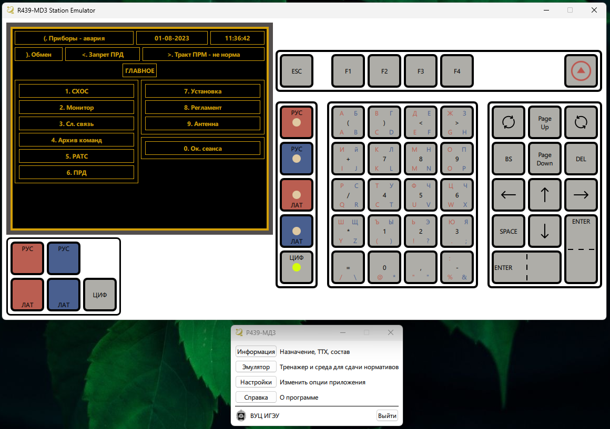

# R-439-MD3 station emulator

This application is a prototype for practicing skills in working at a satellite communication station: setting up various modes, practicing standards, and so on.

The server for taking exams for students is in its infancy. 

The basis is the desktop application. At this point, it's able to understand whether the station devices are configured to a certain standard.